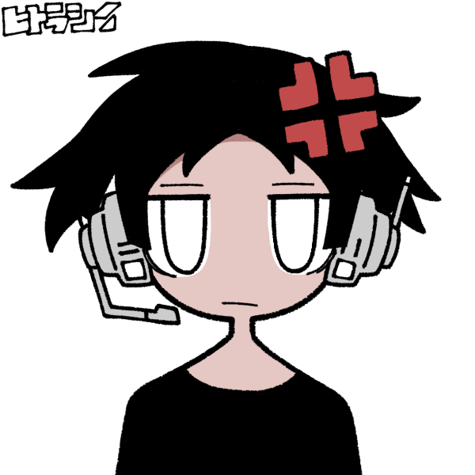

## Olá! Eu sou o Gustavo Russo 👋

- 🔭 I’m currently working on ...
- 🌱 I’m currently learning ...
- 👯 I’m looking to collaborate on ...
- 🤔 I’m looking for help with ...
- 💬 Contate-me no email: gustavorussodecamargo10@hotmail.com
- 📫 How to reach me: ...
- 😄 Pronouns: ...
- ⚡ Fun fact: ...
-->

  

 

  

    
     
    

  

 

 
  
  

# 
